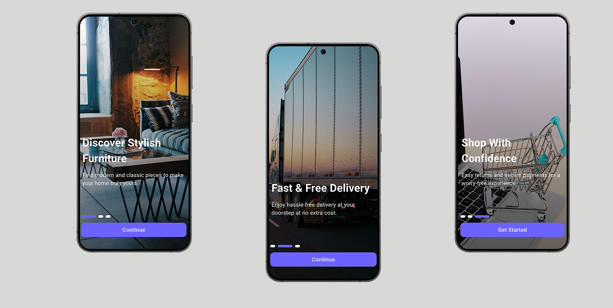
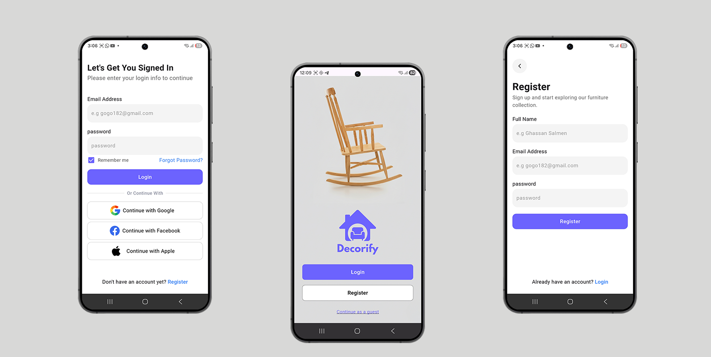
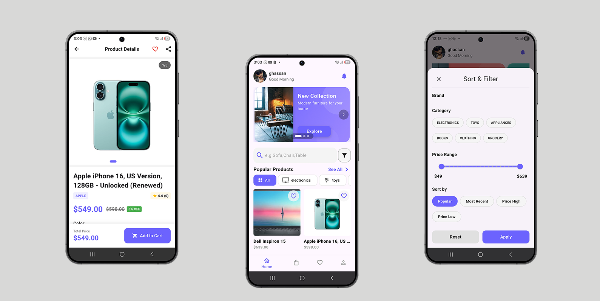
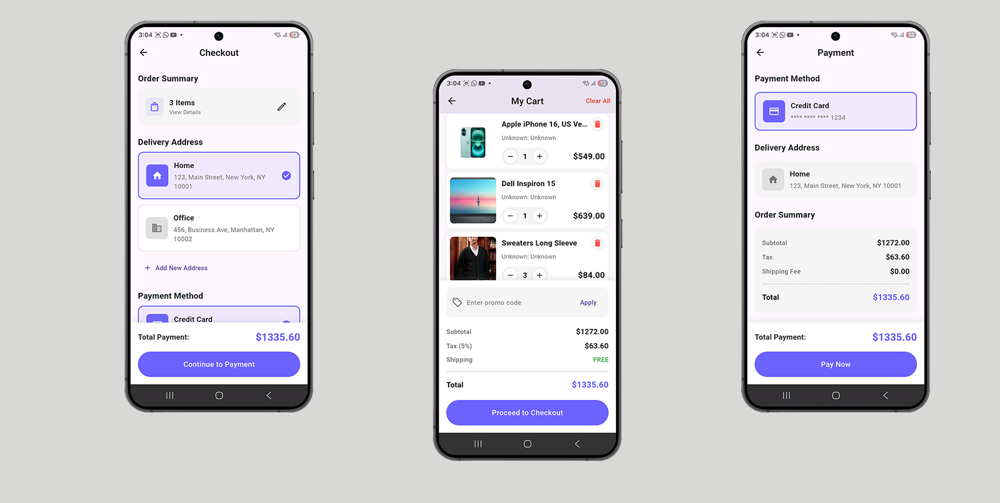
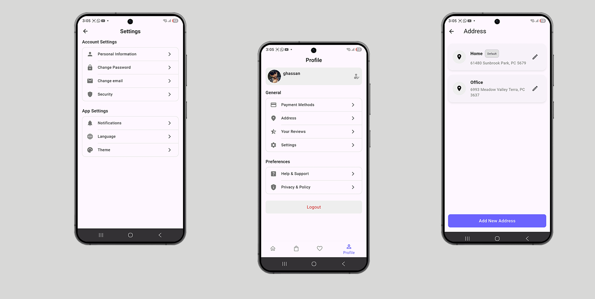

# 🛋️ Decorify - Full Stack E-Commerce Solution

> **🔒 Private Repository Showcase**
>
> This repository demonstrates a production-grade **E-Commerce Ecosystem** consisting of a **Customer App** (Flutter), an **Admin Dashboard** (Flutter), and a secure **Backend API** (Node.js).
> *Source code is available upon request for technical interviews.*

---

## 📱 App Features Overview

### 1. Immersive Onboarding 🚀
A visual walkthrough introduces users to the app's core value propositions: stylish furniture, fast delivery, and secure payments.

 

### 2. Secure Authentication System 🔐
Powered by JWT (JSON Web Tokens). The system supports:
*   Secure Login & Registration
*   Social Authentication (Google, Facebook, Apple)
*   Password Recovery & Guest Mode

 

### 3. Discovery & Advanced Filtering 🔍
Users can explore a vast catalog with high-performance search.
*   **Home Feed:** Dynamic banners and horizontal category scrollers.
*   **Smart Filters:** Filter by Brand, Price Range, and Category.
*   **Product Details:** Rich imagery, rating summaries, and variant selection.

 

### 4. Cart & Checkout Lifecycle 💳
A complete commercial flow handling the user's journey from selection to purchase.
*   **Cart:** Real-time price updates and coupon application.
*   **Checkout:** Address selection and order summary.
*   **Payment:** Secure credit card integration.

 

### 5. Profile & Account Management ⚙️
A dedicated hub for users to manage their data.
*   **Address Book:** CRUD operations for shipping addresses.
*   **Settings:** App personalization and security settings.
*   **Profile:** Order history tracking and review management.

---

## 🏗️ Technical Architecture

This project is built using a **Clean Architecture** approach to ensure scalability and testability.

### **Frontend (Flutter)**
*   **State Management:** Provider / GetX for reactive UI updates.
*   **Networking:** `Dio` client with interceptors for token management.
*   **Storage:** `SharedPreferences` for local session caching.
*   **UI:** Custom design system with Dark/Light mode support.

### **Backend (Node.js & Express)**
*   **Database:** MongoDB (Atlas) with Mongoose ODM for schema validation.
*   **Security:**
    *   `Helmet` (HTTP Headers)
    *   `XSS-Clean` (Sanitization)
    *   `Bcrypt` (Password Hashing)
    *   `Rate Limiting` (DDoS Protection)
*   **Admin Features:** Role-Based Access Control (RBAC) allows Admins to manage products, view sales analytics, and update order statuses via a separate Flutter Admin App.

---

### 📬 Contact

If you are a recruiter or hiring manager and would like to review the code or see a live demo, please reach out:

- **Email:** ghassansalmeen7@gmail.com 📧  
- **LinkedIn:** [@Ghassan Salmeen](https://www.linkedin.com/in/ghassan-muneef-saeed-salmen-779202333/) 🐦  
- **WhatsApp:** [Contact us on WhatsApp](https://wa.me/+917619699362) 📱 
