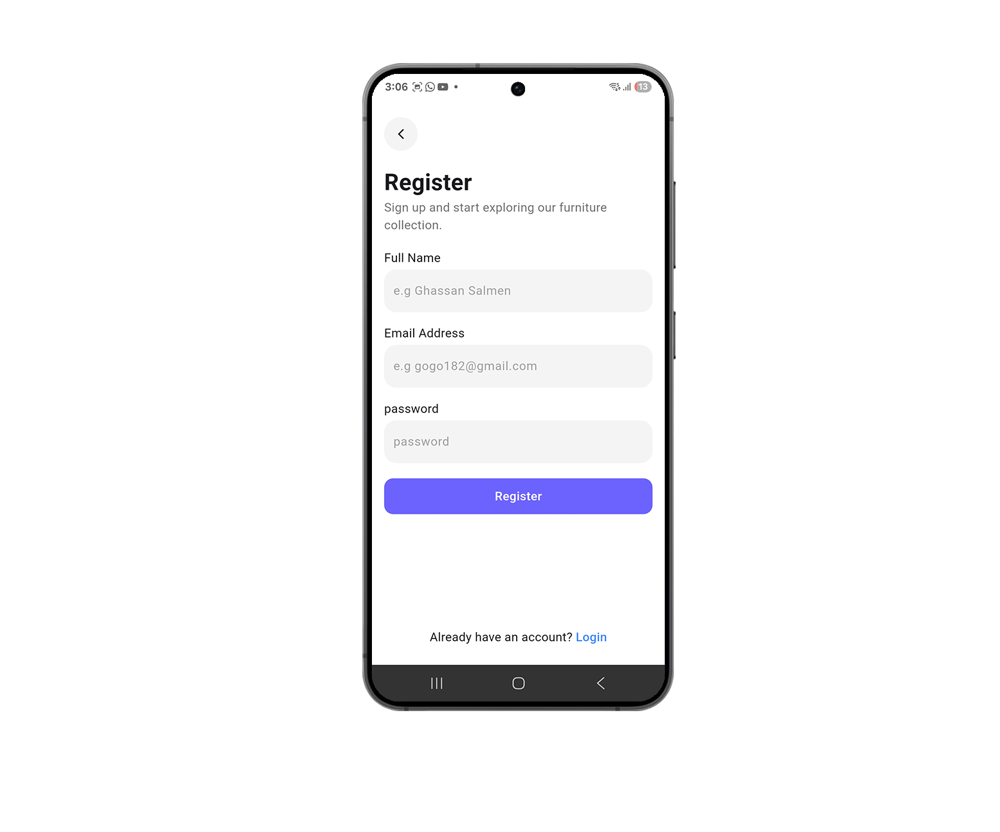
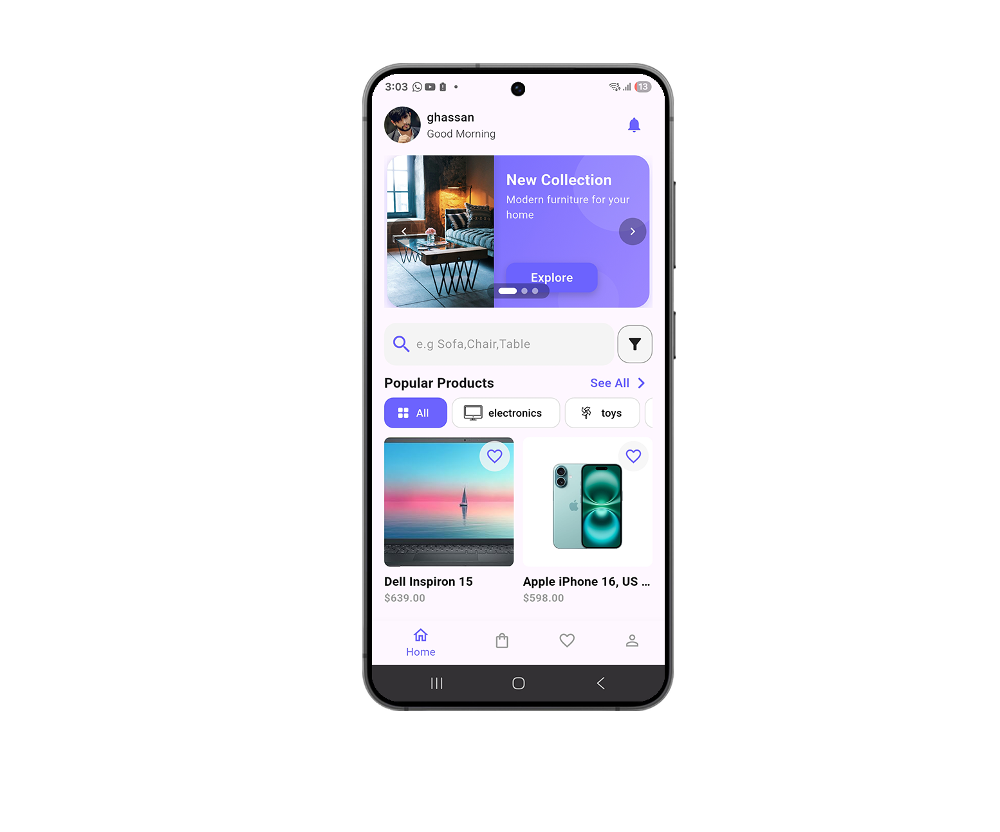
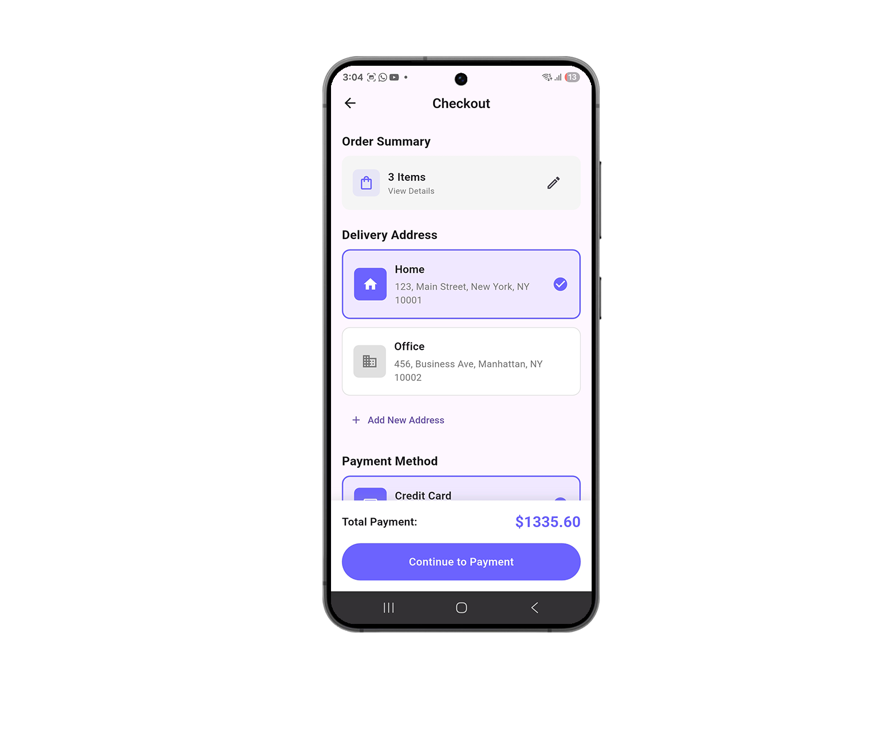
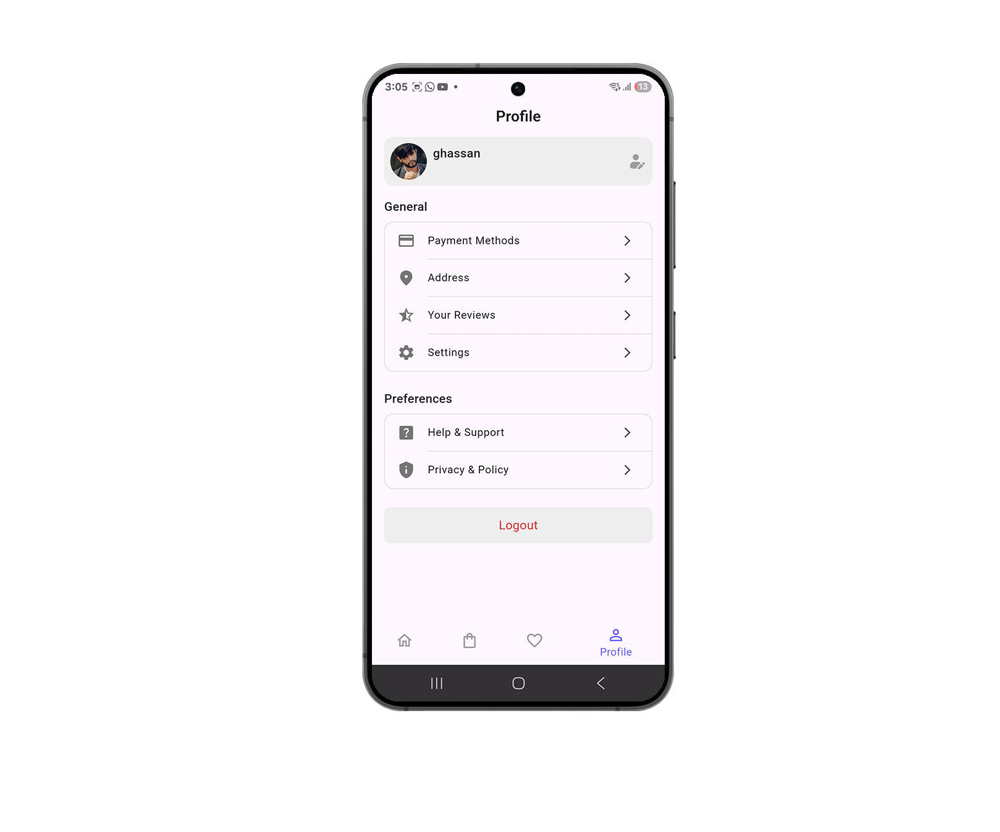
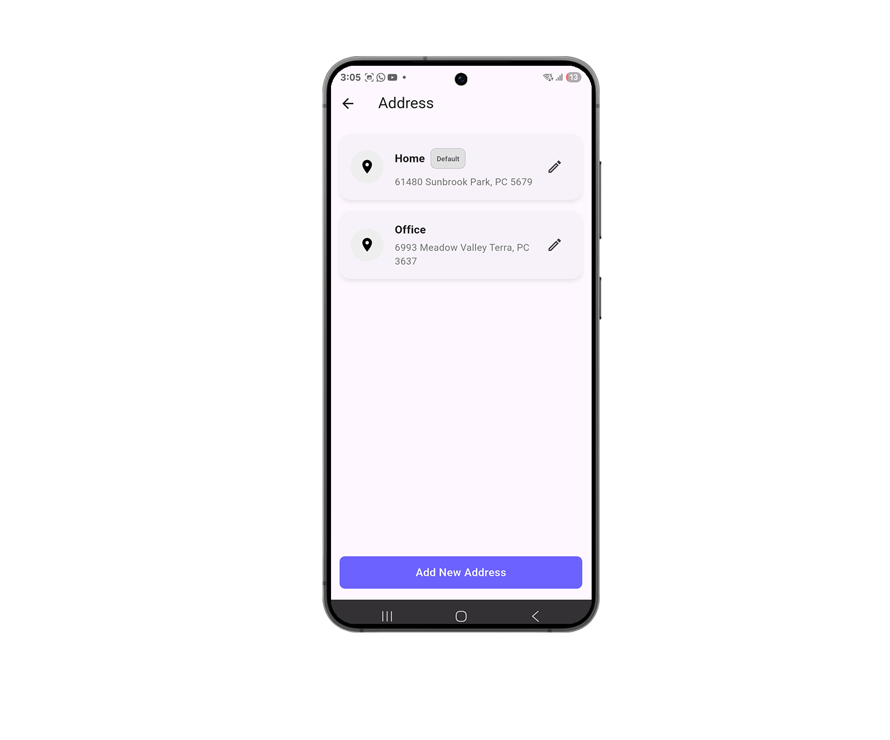

# 🛋️ Modern Furniture E-Commerce Suite

> **🔒 Private Repository Showcase**
>
> This repository serves as a visual demonstration of a full-stack e-commerce ecosystem I developed. It includes a **Customer Mobile App**, an **Admin Dashboard**, and a **Custom Node.js Backend**.
> *Source code is available upon request for technical interviews.*

---

## 📱 Client Application (Flutter)

The customer-facing application allows users to browse, search, and purchase furniture with a focus on UI/UX and smooth performance.

### 1. **Onboarding & Authentication** 🔐
*A seamless entry experience featuring secure JWT authentication, social sign-ins (Google/Apple), and password recovery flows.*

<table border="0">
  <tr>
    <td align="center" width="33%">
      
       <b>Smart Onboarding</b>
    </td>
    <td align="center" width="33%">
      
       <b>Secure Login</b>
    </td>
    <td align="center" width="33%">
      
       <b>Registration</b>
    </td>
  </tr>
</table>

### 2. **Discovery & Product Details** 🛋️
*Advanced filtering and detailed product views. Features include "New Collection" banners, horizontal category scrollers, and rich product imagery.*

<table border="0">
  <tr>
    <td align="center" width="33%">
      
       <b>Home Dashboard</b>
    </td>
    <td align="center" width="33%">
      
       <b>Visual Discovery</b>
    </td>
    <td align="center" width="33%">
      
       <b>Product Specifications</b>
    </td>
  </tr>
</table>

### 3. **Cart & Secure Checkout** 💳
*Complete order lifecycle management. Users can manage cart quantities, select saved addresses, and process payments securely.*

<table border="0">
  <tr>
    <td align="center" width="33%">
      
       <b>Shopping Cart</b>
    </td>
    <td align="center" width="33%">
      
       <b>Order Summary</b>
    </td>
    <td align="center" width="33%">
      
       <b>Payment Gateway</b>
    </td>
  </tr>
</table>

### 4. **User Profile & Management** ⚙️
*A dedicated hub for users to manage their digital footprint, including shipping addresses, security settings, and order history.*

<table border="0">
  <tr>
    <td align="center" width="33%">
      
       <b>Profile Hub</b>
    </td>
    <td align="center" width="33%">
      
       <b>Address Book</b>
    </td>
    <td align="center" width="33%">
      
       <b>App Settings</b>
    </td>
  </tr>
</table>

---

## 💻 Admin Dashboard (Flutter) 📊

A separate Flutter application built for administrators to manage the business logic on the go.

*   **Inventory Control:** Add, update, and delete products with support for variants (size, color).
*   **Order Management:** Track order status (Processing → Shipped → Delivered).
*   **Marketing Tools:** Create and manage discount coupons and promotional banners.
*   **Analytics:** Visual charts displaying sales performance and revenue.

---

## 🔙 Backend API (Node.js) ☁️

The system is powered by a robust REST API built with **Express.js** and **MongoDB**.

### **Key Features:**
*   **🛡️ Security First:** Implemented `Helmet` for headers, `XSS-Clean` for sanitization, and Rate Limiting to prevent brute-force attacks.
*   **🔑 Authorization:** Role-Based Access Control (RBAC) separating `User` and `Admin` privileges.
*   **📦 Advanced Data Models:** Complex schemas handling Categories, Sub-categories, Brands, and Product Variants.
*   **🖼️ Media Handling:** Image upload functionality for product galleries.
*   **🔔 System Notifications:** Integrated notification system for order updates.

---

## 🛠️ Tech Stack Summary

| Domain | Technologies Used |
| :--- | :--- |
| **Mobile (Client & Admin)** | Flutter, Dart, Provider/GetX, Dio, CachedNetworkImage |
| **Backend** | Node.js, Express.js, JWT, Bcrypt.js |
| **Database** | MongoDB, Mongoose ODM |
| **Tools** | Postman, Git, VS Code |

---

### 📬 Contact

If you would like to view the source code or discuss the architecture of this project, please feel free to reach out.

*   **Email:** [Your Email Here]
*   **LinkedIn:** [Your LinkedIn Link Here]
